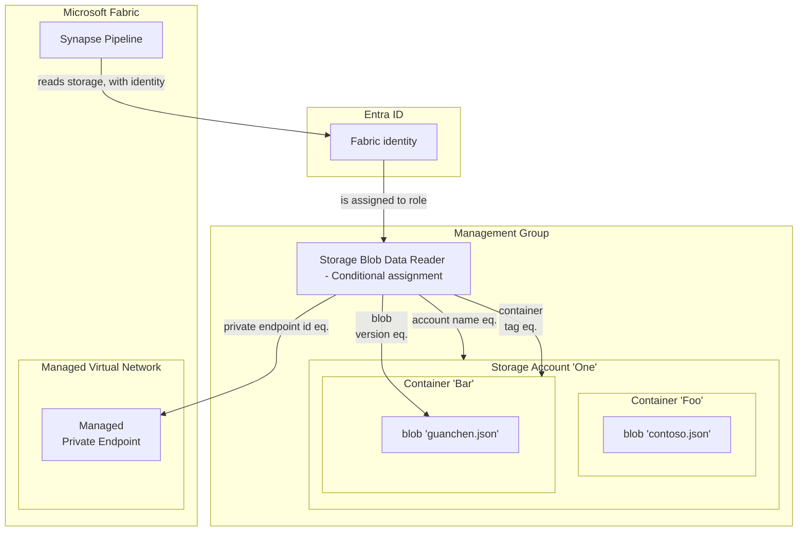

# Traffic filtering with Azure attribute-based access control (Azure ABAC) #

[![CC BY-NC-SA 4.0][cc-by-nc-sa-shield]][cc-by-nc-sa]

[Attribute-based access control (ABAC)](https://learn.microsoft.com/en-us/azure/role-based-access-control/conditions-overview) is an authorization system that defines access based on attributes associated with security principals, resources, and the environment of an access request.

The ability to leverage [environment attributes](https://learn.microsoft.com/en-us/azure/role-based-access-control/conditions-format#environment-attributes) of an access request went [GA in April 2024](https://learn.microsoft.com/en-us/azure/role-based-access-control/conditions-overview#status-of-condition-features) and provides the `Is private link`, `Private endpoint`, `Subnet` and `UTC now` attributes on [some storage roles](https://learn.microsoft.com/en-us/azure/role-based-access-control/conditions-format#actions). With the use of the `Private endpoint` attribute, we can control if our Entra ID role assignment is allowed by checking if the Private Endpoint resource ID matches the one we require. This opens doors for modern ways of looking at network security.

Let's assume you want to give a resource, for instance a Synapse workspace identity, the `Storage Blob Data Reader` role on a specific blob in a storage account. In a traditional way, we would isolate that blob into a container, and assign the role to the container. For secure networking, the traditional way would be to create an isolated storage account, just for that source, and filter traffic with Azure network security groups or firewall rules. With Azure ABAC, we can completely overhaul these concepts with the introduction of the following attribute conditions:

- `@Resource[Microsoft.Storage/storageAccounts:name] StringEquals 'yourStorageAccount'` to verify which storage account is allowed.
- `@Environment[Microsoft.Network/privateEndpoints] StringEqualsIgnoreCase 'allowedPrivateEndpointId'` to verify which network connection is allowed.
- `@Resource[Microsoft.Storage/storageAccounts/blobServices/containers/blobs:isCurrentVersion] BoolEquals true` to only allow reading the current version of a blob.
- `@Resource[Microsoft.Storage/storageAccounts/blobServices/containers/metadata:myKey] StringEqualsIgnoreCase 'myValue'` to only allow containers with metadata key `myKey` and value `myValue`.

By using a combination of these conditions, we can assign roles on a higher level, let's say subscription or even Management Group level. Not only does this reduce the amount of role assignments, it also simplifies the assignment model. Giving out permissions in a pure ABAC way might result in a day-to-day process of assigning the right metadata keys to give certain entities the right access.

It could even be made more flexible on a network level, by checking the subscription and resource group part of the private endpoint id:

- `@Environment[Microsoft.Network/privateEndpoints] StringStartsWith '/subscriptions/92b2afd7-e3db-4660-90c5-0da4aebf53d4/` to allow all private endpoints originating from subscription with id `92b2afd7-e3db-4660-90c5-0da4aebf53d4`.

- `@Environment[Microsoft.Network/privateEndpoints] StringStartsWith '/subscriptions/92b2afd7-e3db-4660-90c5-0da4aebf53d4/resourceGroups/rg-0102/` to allow all private endpoints originating from subscription with id `92b2afd7-e3db-4660-90c5-0da4aebf53d4` and resource group `rg-0102`.

Using network conditions like this creates an architecture where the attributes are replacing the network rules. We can even differentiate between our own tenant endpoints and other tenant endpoints, resulting in a finer grained cross-tenant security model.

The ABAC model as described earlier looks like this visualized:

> Note: It is assumed in this diagram that the Managed Private Endpoint is connected to - and approved in - the storage account.

## ABAC Bicep module ##

To see ABAC in action, the IaC way, the provided [ABAC Bicep module](/abac.bicep) in this repo implements various condition expressions and condition actions for the `Microsoft.Authorization/roleAssignments` resource on a storage account.

## License ##

This work is licensed under a
[Creative Commons Attribution-NonCommercial-ShareAlike 4.0 International License][cc-by-nc-sa].

[![CC BY-NC-SA 4.0][cc-by-nc-sa-image]][cc-by-nc-sa]

[cc-by-nc-sa]: http://creativecommons.org/licenses/by-nc-sa/4.0/
[cc-by-nc-sa-image]: https://licensebuttons.net/l/by-nc-sa/4.0/88x31.png
[cc-by-nc-sa-shield]: https://img.shields.io/badge/License-CC%20BY--NC--SA%204.0-lightgrey.svg
